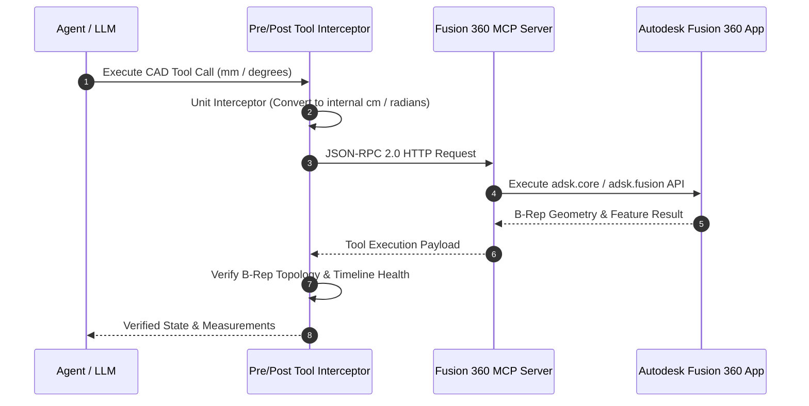

# 🤖 Fusion 360 Model Context Protocol (MCP) Autonomous CAD Agent

**Author:** Mehmet Efe Özhan (METU Mechanical Engineering)  
**Protocol:** Model Context Protocol (MCP) JSON-RPC 2.0 | Autodesk Fusion 360 Python API

---

## 📌 Architecture Overview

This repository implements an autonomous CAD modeling and verification framework that connects Large Language Models (LLMs) to Autodesk Fusion 360 via the **Model Context Protocol (MCP)**.



---

## 5-Stage Gated Execution Loop
1. **QUERY:** Programmatically query active document units, active component, and timeline state.
2. **PLAN:** Generate a strict feature dependency graph (parameters, sketches, extrusions, joints).
3. **EXECUTE:** Invoke atomic MCP primitives via standard JSON-RPC HTTP calls.
4. **VERIFY:** Enforce programmatic bounding box, volume, center of mass, and interference checks (no reliance on visual hallucination).
5. **RECOVER:** Automatic traceback extraction and self-healing parameter adjustments.

---

## 💻 Test & Verification

Run the end-to-end parametric Geneva mechanism verification test:
```bash
python test_geneva_mechanism.py
```
