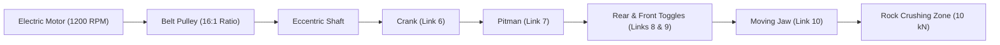

# ⛏️ Industrial Single-Toggle Jaw Crusher Machine Design & Fatigue Suite

**Author:** Mehmet Efe Özhan (METU Mechanical Engineering)  
**Equations & Standards:** Shigley's Mechanical Engineering Design (10th Ed.), ISO 286 Fits, Soderberg / Modified Goodman Criteria

---

## 📌 System Overview

This repository contains the complete kinematic, force equilibrium, shaft fatigue, pin shear/bearing, and fillet weld design pipeline for an industrial **10 kN single-toggle jaw crusher**.



---

## 📐 Mathematical Formulation

### 1. Euler-Eytelwein Belt Friction
- **Tension Ratio:**
  $$\frac{F_1}{F_2} = e^{f \alpha}, \quad \alpha = \pi + 2 \arcsin\left(\frac{D - d}{2C}\right)$$
- **Input Torque & Reaction Forces:**
  $$T_{\text{shaft}} = (F_1 - F_2) \frac{D}{2}$$

### 2. Shaft Fatigue Sizing (Soderberg Criterion)
- **Iterative Diameter Convergence:**
  $$d^3 = \frac{32 n}{\pi} \left[ \frac{\sqrt{(K_f M_a)^2 + \frac{3}{4}(K_{fs} T_a)^2}}{S_e} + \frac{\sqrt{(K_f M_m)^2 + \frac{3}{4}(K_{fs} T_m)^2}}{S_y} \right]$$
- **Marin Endurance Limit Modifiers:**
  $$S_e = k_a k_b k_c k_d k_e S_e', \quad k_a = 4.51 S_{ut}^{-0.265}$$

### 3. Pin Design & ISO 286 Tolerances
- **Combined MSST Failure:**
  $$\tau_{\max} = \sqrt{\left(\frac{16 M_{\max}}{\pi d^3}\right)^2 + \left(\frac{2 F_8}{\pi d^2}\right)^2} \le \frac{S_y}{2n}$$
- Solved using `scipy.optimize.fsolve` and rounded to standard ISO 286 $H7/f7$ clearance fit.

### 4. Mounting Bracket Fillet Welds (Modified Goodman)
- **Unit Throat Shear Stress:**
  $$\tau_{\text{unit}} = \sqrt{\tau_{\text{vertical}}^2 + \tau_{\text{horizontal}}^2}$$
- **Required Leg Size ($h$):**
  $$h = n \cdot \tau_{\text{unit}} \left( \frac{1}{S_{se}} + \frac{1}{S_{su}} \right)$$

---

## 💻 Usage

Execute the complete kinematic, dynamic, and stress analysis:
```bash
python Kinematic_Force_Analysis.py
```
Generated shear and moment diagrams are saved automatically to `.png` files.
