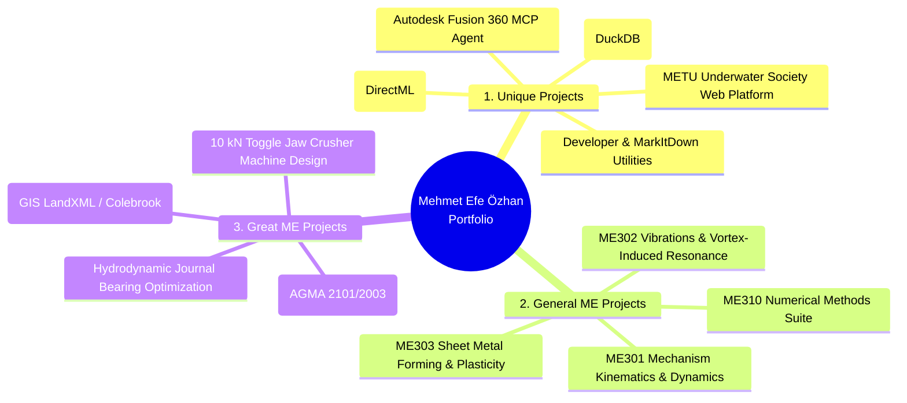

# 🚀 Engineering & Software Portfolio — Mehmet Efe Özhan

**Mechanical Engineering Senior | Middle East Technical University (METU / ODTÜ)**  
*Ankara, Turkey | efe.ozhan@metu.edu.tr | [LinkedIn](https://www.linkedin.com/in/efe-ozhan-a51938192/) | [GitHub](https://github.com/mefeozh)*

---

## 📌 Portfolio Architecture Overview

This portfolio showcases selected computational, mechanical design, simulation, and software systems developed during academic R&D, engineering internships, and independent research.

---

## 📁 Repository Directories

| Directory | Scope & Focus | Key Methodologies & Technologies |
| :--- | :--- | :--- |
| [**`1_unique_projects/`**](./1_unique_projects) | AI Agents, CAD Automation, Deep Learning & High-Throughput Data | Model Context Protocol (MCP), PyTorch/DirectML, DuckDB, Polars, Hugo SSG, Win32 API |
| [**`2_general_me_projects/`**](./2_general_me_projects) | Core Mechanical Engineering, Numerical Solvers & Dynamics | Splines, Bézier Curves, Illinois Root Finders, TDMA Thomas Algorithm, D'Alembert Dynamics, VIV Damping |
| [**`3_great_me_projects/`**](./3_great_me_projects) | Flagship Design, Fatigue, Tribology & Fluid Infrastructure | AGMA 2101/2003 Stress Analysis, Soderberg Fatigue, Ocvirk Hydrodynamic Lubrication, Trumpler Criteria, Colebrook-White GIS Hydraulics |

---

---
*Maintained by Mehmet Efe Özhan. All code modules made only for educational purposes.*
